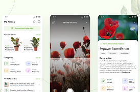

# 📊 Management Dashboard

<div align="center">


**A modern, responsive project management dashboard built with HTML, CSS & JavaScript.**

</div>

---

## 📝 Project Description

**Management Dashboard** is a clean and modern web-based project management interface that helps teams organize and track their tasks efficiently. The dashboard features a Kanban-style board with three columns — **To Do**, **On Progress**, and **Done** — allowing users to manage project tasks at a glance.

The project includes a collapsible sidebar for navigation, a global search bar, a notification system, user profile display, and a fully interactive task management board.

---

## ✨ Features

| Feature | Description |
|---|---|
| 📌 Kanban Board | Three-column task board: To Do, On Progress, Done |
| 🔍 Search Bar | Global search functionality across projects |
| 🔔 Notifications | Bell icon with notification dropdown |
| 👤 User Profile | Profile section with name, avatar, and location |
| 📂 Sidebar Navigation | Collapsible sidebar with icon-based navigation |
| 🏷️ Task Priority Labels | Low / High priority tags on each task card |
| 💬 Task Details | Comment count, file count displayed per task |
| ➕ Add Project | Input field to create new projects on the fly |

---

## 🛠️ Technologies Used

### Languages:
-  **HTML5** — Page structure and semantic markup
-  **CSS3** — Styling, Flexbox, Grid, animations
-  **JavaScript (ES6+)** — Interactivity and DOM manipulation

### Libraries & Tools:
- 🎨 **Font Awesome** — Icon library for UI icons
- 🔤 **Google Fonts** — `Barlow Semi Condensed` typeface
- 🐙 **Git & GitHub** — Version control and repository hosting

### Design System:
| Property | Value |
|---|---|
| Primary Color | `#1689E7` (Blue Accent) |
| Background | `#F6F8FC` (Light Gray) |
| Card Color | `#FFFFFF` (White) |
| Primary Font | `Barlow Semi Condensed` |
| Layout | Flexbox + CSS Grid |

---

## 📸 Screenshots

### 🖥️ Full Dashboard View


### 📋 Kanban Board — Task Management


### 📁 Project Cards


---

## 🚀 How to Run

Follow these simple steps to run the project locally:

### Prerequisites
- A modern web browser (Chrome, Firefox, Edge, Safari)
- A code editor like **VS Code** *(optional)*

### Steps

**1. Clone the repository:**
```bash
git clone https://github.com/Suliman-Al-Helou/github-training-project.git
```

**2. Navigate to the project folder:**
```bash
cd github-training-project
```

**3. Open the project:**

- **Option A** — Double-click `index.html` to open it directly in your browser.
- **Option B** — Use the **Live Server** extension in VS Code:
  1. Open the project folder in VS Code
  2. Right-click on `index.html`
  3. Select **"Open with Live Server"**

> ✅ No installation, no build tools, no dependencies required!

---

## 📁 Project Structure

```
Management-Dashboard/
│
├── index.html          # Main HTML file
├── README.md           # Project documentation
│
├── css/
│   └── style.css       # Main stylesheet
│
├── js/
│   └── main.js         # JavaScript logic
│
└── image/              # Project images and assets
    ├── user.jpg
    ├── users-1.jpg
    └── ...
```

---

## 👨‍💻 Student Information

<div align="center">

| | |
|---|---|
| **Name** | Suliman Al Hellou |
| **University** | University of Palestine — Gaza |
| **Project** | Management Dashboard |
| **Course** | Front-End Web Development |

</div>

---

<div align="center">

Made with ❤️ by **Suliman Al Hellou**

</div>